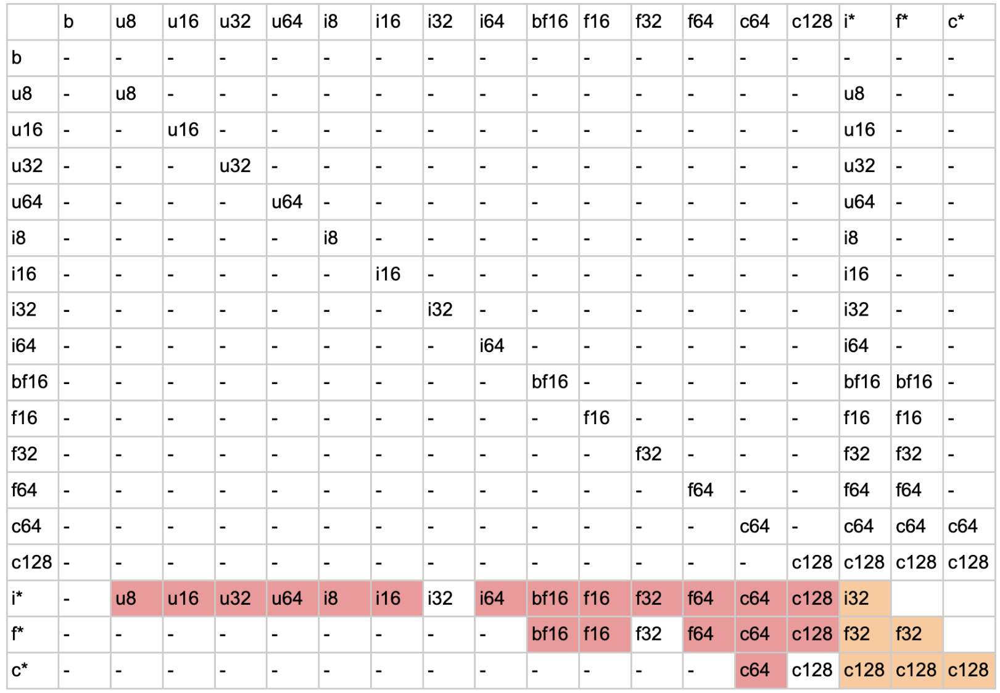
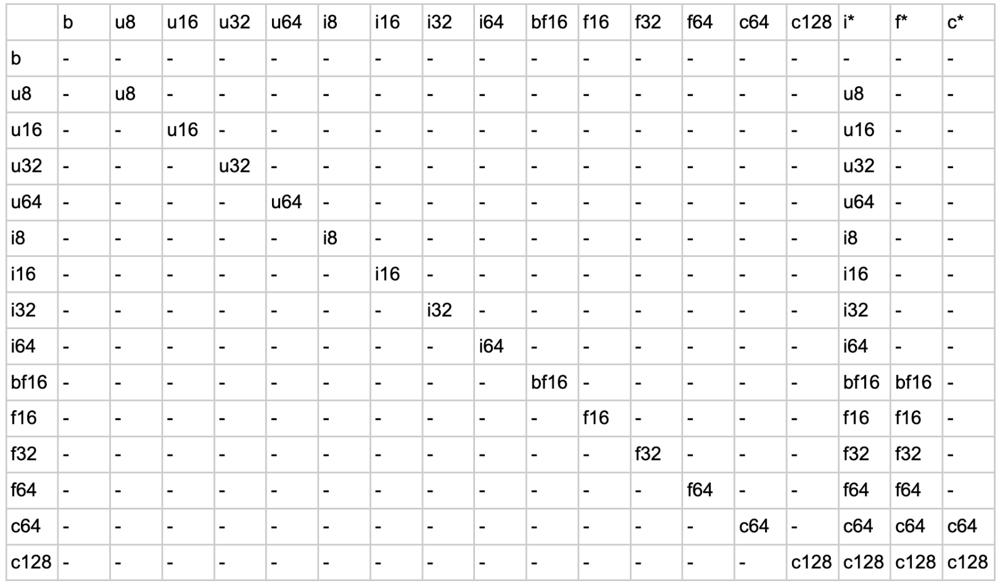
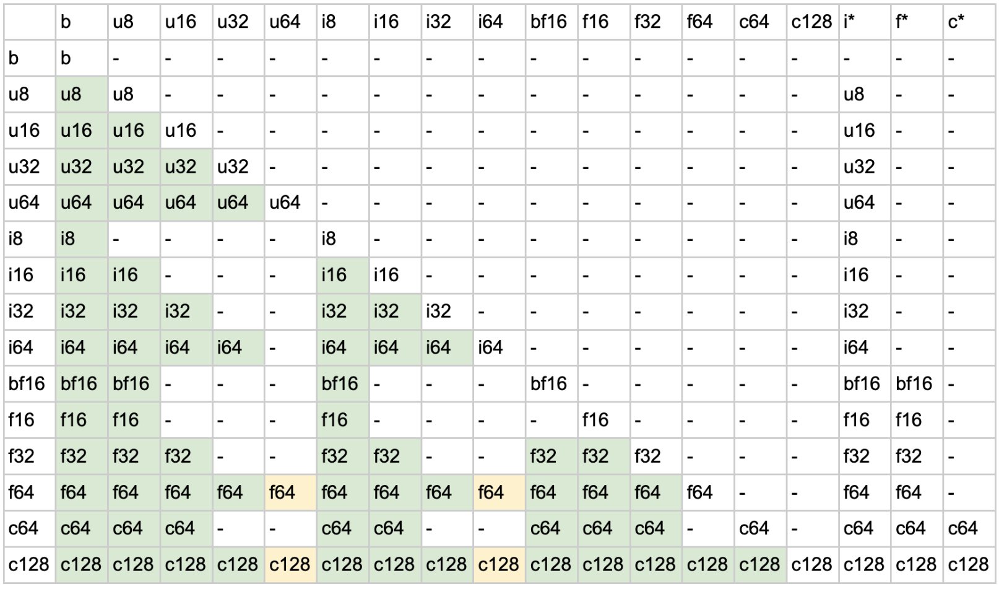
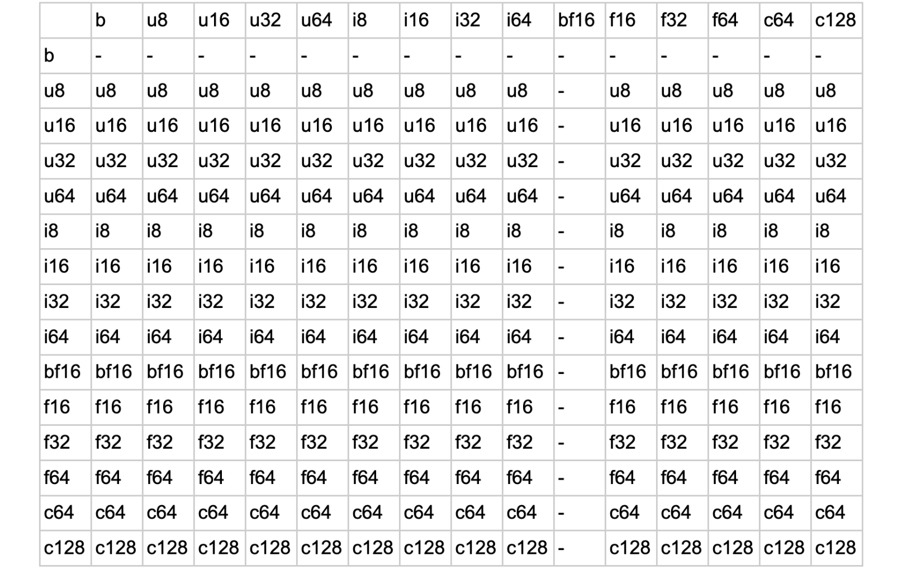
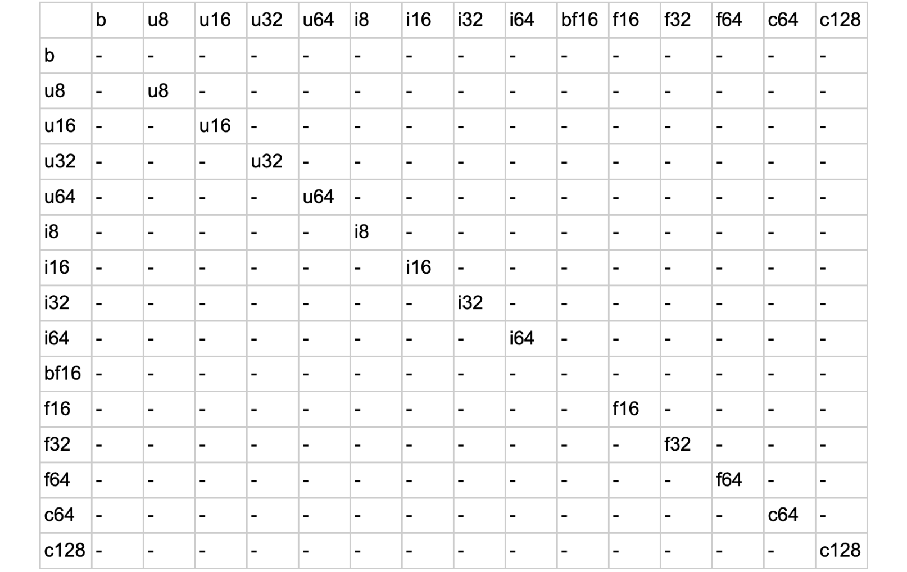

<!-- Copy and paste the converted output. -->


# Making dtype promotion semantics in Tensorflow more consistent

| Status        | (Proposed)       |
:-------------- |:---------------------------------------------------- |
| **RFC #**     | 431|
| **Author(s)** | Jiawei Xia (Google), Antonio Sanchez (Google) |
| **Sponsor**   | Peng Wang (Google)                      |
| **Updated**   | 2022-10-18                                           |


## **Objective**

Currently TF has no consistent, well-defined type promotion rules. This document proposes a well-defined, consistent and clear dtype promotion rule for TF. The introduced changes make TF APIs more similar to NumPy, with some differences that emphasize TF’s applications in machine learning. This should make dtype promotions in TF much more consistent and predictable.

[**What the doc is**] This doc discusses the preferred dtype promotion semantics/behaviors of Tensorflow (TF) and Tensorflow-numpy (TF-numpy) in the binary ops including add, sub, mul, div, pow and mod.

[**What the doc is not**] This doc does not discuss the implementation plans.


## **Motivation**

In Tensorflow’s APIs, dtype promotion is very broken compared to JAX or NumPy. Many users have complained about these surprising behaviors ([example](https://github.com/tensorflow/tensorflow/issues/38658)).

[TF-numpy](https://www.tensorflow.org/guide/tf_numpy#type_promotion) is a strategic project in Tensorflow. Compared to Tensorflow, TF-numpy’s dtype promotion behavior is more consistent because it [mainly relies on NumPy’s dtype promotion semantics](https://github.com/tensorflow/tensorflow/blob/a3a9d4d6538b025d0c6c821a72076e084a5b597b/tensorflow/python/ops/numpy_ops/np_dtypes.py#L112). Based on TF-numpy’s dtype promotion semantics we can develop a long-term, user-friendly solution for TF. 


## **User Benefit**

There have been ongoing complaints about the inconsistent dtype promotion behaviors of TF. To give an example, switching the inputs’ positions directly affects the outcome:


```
c = tf.constant(1.0)
tf.add(c, 3)  # tf.Tensor(4.0, shape=(), dtype=float32)
tf.add(3, c)  # InvalidArgumentError: cannot compute AddV2 as input #1(zero-based) was expected to be a int32 tensor but is a float tensor [Op:AddV2]
```


For brevity we will sometimes use shortened terms to represent the dtypes as shown in the following examples:


*   `b` means tf.bool
*   `u8` means tf.uint8
*   `i16` means tf.int16
*   `bf16` means [tf.bfloat16](https://cloud.google.com/tpu/docs/bfloat16)
*   `f64` means tf.float64
*   `c64` means tf.complex64
*   `i*` means python int
*   `f*` means python float
*   `c*` means python complex

The table below summarizes the dtype promotion behavior between two TF tensors/python scalars with method `__add__` and API `tf.add` respectively. Each row and column represents a combination of input types.

<p align="center">
Table: TF dtype promotion result of dunder method `__add__` and `tf.add` 


</p>

In the table, the dash symbol `-` means unsupported: an error gets raised if the two dtypes are used in the call to that op. The cells highlighted in red are only supported in `__add__`, and the cells in yellow are only supported in `tf.add`. In summary, the existing TF APIs have these significant issues:


1. Boolean dtypes are not supported;
2. Implicit conversion between two TF dtypes are strictly disallowed, resulting in verbose code at times; 
3. Implicit conversion from some python dtypes to some TF dtypes are disallowed;
4. `tf.add` is not even commutative - switching the position of the two arguments sometimes produces errors, otherwise results in correct values.

When the inputs involve NumPy arrays, the behaviors can be even more broken. For brevity we have included NumPy-input behaviors in [a sub section](#are-there-also-issues-in-conversions-between-tensor-and-numpy-arrays) at the end of the doc.

We aim to make the system commutative, predictable and correct.


## **Design Proposal**

We propose introducing three dtype promotion modes in TF:


*   `tf.ImplicitPromotion.ALL`
*   `tf.ImplicitPromotion.SAFE`
*   `tf.ImplicitPromotion.NONE`

The three modes determine how often implicit dtype promotions happen in TF APIs. In the following examples we will use `tf.add` to demonstrate the modes. The dunder method `__add__` is expected to have the same behavior as `tf.add`. For brevity, NumPy (np) array inputs are not discussed in this section. However the proposed modes in this RFC will treat the np array inputs in the same way as the tensor inputs (see more in the [bottom](#are-there-also-issues-in-conversions-between-tensor-and-numpy-arrays)).

<p align="center">
Table: TF dtype promotion result of `tf.add` after the proposed changes. `NONE` only allows the unhighlighted cells. `SAFE` allows all `NONE` cases plus the cells highlighted in green. `ALL` allows all `SAFE` cases plus the cells highlighted in yellow. Rows/columns highlighted in blue only show the default result without overflow of inputs.


</p>


### **Mode 1: tf.ImplicitPromotion.ALL**

In this mode, we allow all implicit promotions to happen in the op, even if both inputs have TF dtypes. To summarize the rules of this mode:


*   When the two inputs have non-matching TF dtypes, they will be promoted to the lowest width dtype that guarantees the precisions and ranges of the inputs. However, the promoted integer, float and complex dtype widths are capped at 64, 64 and 128 bits respectively. For example:
    *   The summation of `tf.bfloat16` and `tf.uint8` will be type `tf.bfloat16`.
    *   The summation of `tf.int64` and `tf.float64` will be capped at type `tf.float64` despite precision loss and overflow risks.
*   When one of the inputs is a python integer/float/complex, and the other is a TF dtype:
    *   If the python scalar value falls within the range of the TF dtype, the result dtype is loosely described with the following promotion direction: TF bool -> python integer -> TF signed/unsigned integers -> python float -> TF float -> python complex/TF complex.
    *   The dtype promotion is allowed only if the python scalar is within the range of the determined dtype. Otherwise, an exception is raised. For example, `tf.constant([1], tf.int8) + 1` produces a `tf.int8` Tensor, while `tf.constant([1], tf.int8) + 1000` raises an error.

This mode is intended to provide a user experience somewhat similar to NumPy behaviors.


### **Mode 2: tf.ImplicitPromotion.SAFE**

Mode `SAFE` follows the same rules as mode `ALL`, but disallows “unsafe” dtype promotions. In general, we think the following two types of conversions are unsafe:


*   If the inputs are both Tensors and the result dtype would be “wider” than all the inputs. For example, the summation of `tf.uint8` and `tf.int8` would be type `tf.i16`. These dtype promotions risk increasing the model’s memory consumption and slowing down computation speed.
*   If the inputs are both Tensors and the result dtype cannot preserve all the precisions of the inputs. For example, the summation of `tf.uint64` and `tf.float32` would be type `tf.float64`.

With the above principle, if one of the inputs is a Tensor while the other is a python scalar, we only allow implicit promotion if the scalar can fit into the Tensor’s dtype. For example:


*   The summation between a `tf.int32` and a python float is always disallowed;
*   The summation between a `tf.uint8` and a python int is allowed only if the python int is between 0 and 255.

For these disallowed dtype promotions, we require the users to explicitly cast them.

Another advantage is that mode `ALL` can be silently nonassociative in the following scenario, while mode `SAFE` avoids it by not allowing any dtype widening:


*   `(tf.zeros(tf.uint8) + tf.zeros(tf.int8)) + tf.zeros(tf.float16)` evaluates to dtype `tf.float32`;
*   `tf.zeros(tf.uint8) + (tf.zeros(tf.int8) + tf.zeros(tf.float16))` evaluates to dtype `tf.float16`. 


### **Mode 3: tf.ImplicitPromotion.NONE**

The dtype behavior of mode `NONE` is the most conservative: no dtype promotion is allowed between Tensors. When the inputs include python scalars, it follows the same rule as mode `SAFE`.


### **Alternatives Considered: Capping the promotion system at float32**

The TF-NumPy project contains another flag <code>[allow_float64](https://github.com/tensorflow/tensorflow/blob/a3a9d4d6538b025d0c6c821a72076e084a5b597b/tensorflow/python/ops/numpy_ops/np_dtypes.py#L88)</code>. When disabled, it caps the converted floating numbers to 32 bits, and complex numbers to 64 bits. This is useful when users want to enjoy implicit conversions in all cases and avoid any performance regressions related to double precision floating point numbers.

Our current plan does not involve adding this flag in TF, as it’s orthogonal to the proposed modes. If there are more user needs we can consider exposing it in TF as well.


### **Alternatives Considered: A dtype promotion “lattice”**

Unlike the approaches above, JAX used a dtype promotion lattice to define its semantics. More details can be seen in their [design doc](https://jax.readthedocs.io/en/latest/jep/9407-type-promotion.html#properties-of-a-type-promotion-lattice). Their lattice system has these advantages:


*   A lattice can be much more concise to describe the promotion semantics;
*   The lattice can ensure associativity as well as commutativity. In contrast, the promotion behaviors in this proposal is not associative: 
    *   `(tf.zeros(tf.uint8) + tf.zeros(tf.int8)) + tf.zeros(tf.float16)` evaluates to dtype `tf.float32`;
    *   `tf.zeros(tf.uint8) + (tf.zeros(tf.int8) + tf.zeros(tf.float16))` evaluates to dtype `tf.float16`.


Compared to a lattice system, the proposed table-based system does not guarantee associativity. However, we can avoid such usage scenarios in the proposed SAFE mode (no implicit promotion to wider dtypes). As a result, it’s not clearly justifiable to switch to a lattice system from the table-based approach, which already exists in project TF-NumPy. 


### **Alternatives Considered: Value-dependent promotion (a.k.a. “safe casting” in  NumPy)**

NumPy has a feature “safe casting”: the dtype promotion API, <code>[numpy.result_type](https://numpy.org/doc/stable/reference/generated/numpy.result_type.html)</code>, can return a different dtype depending on the input python scalar value:


```
np.result_type(np.int8, 200) # dtype('int16')
np.result_type(np.int8, 100) # dtype('int8')
```


This slightly reduces the risk of overflow. However, the result is unpredictable. NumPy is considering removing this feature in a future release (see proposal: [NEP 50](https://numpy.org/neps/nep-0050-scalar-promotion.html)). JAX [did not adopt this feature](https://jax.readthedocs.io/en/latest/jep/9407-type-promotion.html#enter-python-scalars) either. We omit it in this design. 


### **Performance Implications**

<span style="text-decoration:underline;">For an existing piece of TF code in python, we do not expect the performance to change after switching to any of the proposed modes.</span> This is because all the allowed implicit dtype promotions in TF will stay unchanged. As to the currently disallowed dtype promotions, users must have used explicit dtype promotions which are not affected by the change.

When users develop a new piece of code, however, the mode `ALL` has higher chances of computation slowdown due to implicit promotions to wider types.

We can carry out the following steps to mitigate user surprises:


*   Add benchmark tests to verify that the new modes won’t affect the performance of existing TF code.
*   Publish tutorials that help users select the most appropriate dtype promotion modes.
*   [optional] Add an API that instruments the number of implicit, unsafe dtype conversions in the program (e.g. promotions from 32 bits to 64 bits). This helps users understand whether the promotions contribute to computation slowdown in the graphs.


### **Dependencies**

This proposal is not expected to affect dependencies to Tensorflow.


### **Engineering Impact**


We do not expect changes in binary size/startup time/build time/test time. The majority of the dtype promotion logic already exists in Tensorflow under namescope `tensorflow.experimental.numpy`. However, refactoring/updates will be needed under directory tensorflow/python/ops.


### **Platforms and Environments**

This proposal is expected to take effect on all platforms in the python environment.


### **Best Practices/Tutorials and Examples**

As mentioned in section “Performance Implications” we will publish tutorials that help users select the most appropriate dtype promotion modes.


### **Compatibility/User Impact**

This is a breaking change. As mentioned above, existing code is expected to continue working. However, some tests will fail because more implicit dtype conversions are allowed. We can mitigate the user impact by adding a flag that sticks to the existing dtype promotion behaviors.

The proposed changes will be rolled out in various stages:


1. Default behaviors stay unchanged, with the flags introduced under namescope `tf.experiment` to collect user feedbacks;
2. Default behaviors switched to one of the modes above, while the old behaviors can be re-enabled via a flag;
3. [optional] Completely disable the old, broken dtype promotion behaviors.


### **Questions and Discussion Topics**


#### **Are there changes expected in tf.Variable?**

In APIs such as `tf.add` and dunder methods `__add__`, the same changes are expected to take place because these methods first read the Variable into a Tensor, then carry out the Tensor-to-Tensor computations.

Currently, inplace ops such as `assign_add` are also broken. The two tables below show the result of `assign_add` when the input is a Tensor, a python scalar or a NumPy array:


*   When the input is a Tensor, no dtype conversion is allowed.
*   When the input is a python scalar, it defers to the variable’s dtype. However, python float cannot be converted to int, and complex cannot be converted to either int or float dtypes.
*   When the input is a NumPy array, it always gets converted to the variable’s dtype regardless of any precision loss (for example `tf.Variable(1) + np.array(1.5)` returns 2).


<p align="center">
Table: Result of tf.Variable (rows) inplace op `assign_add` with a Tensor or python scalar as the argument (columns).


</p>


<p align="center">
Table: Result of tf.Variable (rows) inplace op `assign_add` with a NumPy array as the argument (columns).


</p>


We can make these ops more consistent as well, following the rules in the three proposed modes. However, we also have another constraint: the Variable’s dtype cannot change. As a result, any dtype promotion that results in a dtype different from the Variable’s dtype is disabled.


<p align="center">
Table: Result of tf.Variable (rows) inplace op `assign_add` with a Tensor or python scalar as the argument (columns) after the proposed changes. `NONE` only allows the unhighlighted cells. `SAFE` allows all `NONE` cases plus the cells highlighted in green. `ALL` allows all `SAFE` cases plus the cells highlighted in yellow.


</p>


#### **Are there also issues in conversions between Tensor and numpy arrays?**

There exists arguably more serious issues when it comes to the mixture of Tensor and numpy arrays - wrong results can appear silently:


```
a = np.array(3.1)
c = tf.constant(1)
print(tf.add(a, c))  # InvalidArgumentError: cannot compute AddV2 as input #1(zero-based) was expected to be a double tensor but is a int32 tensor [Op:AddV2]
print(tf.add(c, a))  # tf.Tensor(4, shape=(), dtype=int32) - Even worse than exceptions
```


To give a comprehensive overview, the two tables below show the results of `tf.add(tensor, numpy array)` and `tf.add(numpy array, tensor)` :

<p align="center">
Table: TF dtype promotion result of `tf.add` with a Tensor as the first argument (rows) and np array in the second argument (columns).


</p>


<p align="center">
Table: TF dtype promotion result of `tf.add` with a np array as the first argument (rows) and tensor in the second argument (columns).


</p>


To briefly describe the issues:


1. dtypes `tf.bfloat16` and `tf.bool` are poorly supported;
2. If the first input is a tensor, the second input (the np array) is always converted to the tensor’s dtype, resulting into significant precision loss in many scenarios;
3. If the first input is a np array and the second is a tensor, the np array is first converted to a tensor with the corresponding dtype. TF then does not attempt any implicit dtype conversion, causing `InvalidArgumentError` whenever the two inputs have mismatching dtypes. 

Though the behaviors with np arrays inputs are not the same as python scalars, they share the same root cause: At present, TF does not have a centralized dtype promotion system, and incorrectly uses the [dtype of the first Tensor in its list of arguments](https://github.com/tensorflow/tensorflow/blob/a3a9d4d6538b025d0c6c821a72076e084a5b597b/tensorflow/python/ops/math_ops.py#L1371) to promote all arguments to. <span style="text-decoration:underline;">The proposed modes in this RFC will treat the np array inputs in the same way as the tensor inputs</span>.


#### **What happens to truediv operations?**

The op truediv is special because it implicitly promotes integral types. For example when the inputs are matching dtypes, 16-bit integral types are promoted to `f32`, and 32-bit integral types are promoted to `float64`.

Using this rule of thumb, we can easily deduce the promotion behavior between non-matching dtypes when this proposal is landed. For example:


*   `int8` and `int16` -> both `int16` -> `f32` (allowed in `SAFE/ALL` modes)
*   `uint8` and `uint32` -> both `uint32` -> `f64` (allowed in `SAFE/ALL` modes)
*   `int8` and `i*` -> both `int8` -> `f32` (allowed in `NONE/SAFE/ALL` modes)
*   `int8` and `uint16` -> both `int32` -> `f64` (allowed in `ALL` mode)

In the above examples, the first arrow represents the dtype promotion in this proposal, and the second arrow represents the promotion in op truediv. Note the result of `int8` and `uint16`, `f64`, turns out to be an overkill but is consistent with the combination of the dtype promotion rules and the truediv promotion rules.
